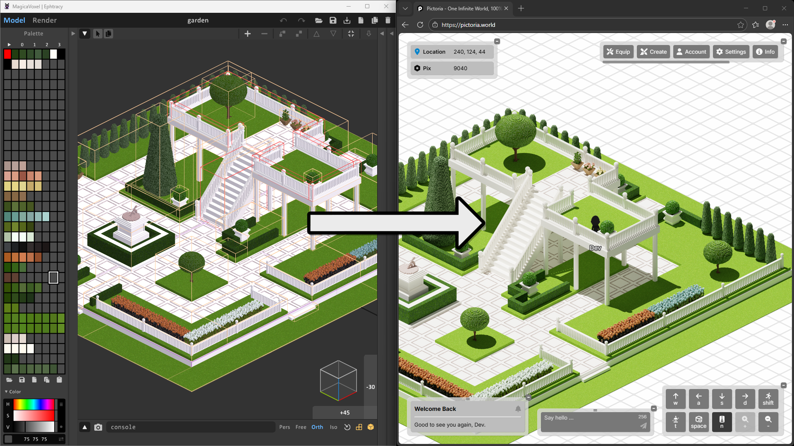
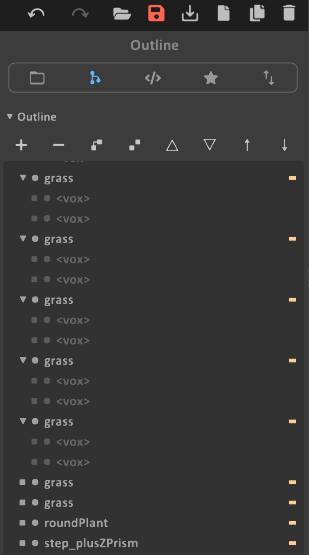

# Vox2Pictoria

A command-line tool that converts [MagicaVoxel](https://ephtracy.github.io/) `.vox` files into art for [Pictoria](https://pictoria.world).



## Overview

### What is Pictoria?
Pictoria is a web-based, isometric world.

Users buy properties (plots of land) and build structures on them.

Structures can be sized and positioned, as well as textured using uploaded 2D images.

### What is MagicaVoxel?
MagicaVoxel is a free voxel (volumetric pixel/textured cube) art editor.

It allows users, including non-artists, to create beautiful 3D scenes, which can be exported as `.vox` files.

### What is Vox2Pictoria?
Vox2Pictoria is a program that takes a `.vox` file and produces dimensions, locations and 2D images for creating structures in Pictoria.

## Prerequisites
- [MagicaVoxel 0.99.7.2](https://ephtracy.github.io/) (for creating `.vox` files)

## Installation

1. Download the latest release for your platform from the [Releases](https://github.com/PictoriaWorld/Vox2Pictoria/releases) page.

2. Extract the zip to a permanent location (e.g. `C:\Vox2Pictoria` on Windows or `~/Vox2Pictoria` on Mac).

3. Add the extracted folder to your system PATH: on Windows, search for "environment variables" in the Start menu, click *Edit the system environment variables > Environment Variables*, select `Path` under User variables, click *Edit*, and add the folder path. Restart your terminal afterward.

4. **Mac only** - open Terminal, then run the following commands to make the binaries executable and unblock them:
```bash
chmod +x ~/Vox2Pictoria/Vox2Pictoria ~/Vox2Pictoria/blender/blender
xattr -cr ~/Vox2Pictoria
```
To add to PATH permanently, add `export PATH="$HOME/Vox2Pictoria:$PATH"` to your `~/.zshrc` file.

5. Verify the installation by opening a new terminal and running:
```bash
Vox2Pictoria --help
```

## Usage

1. Create a `.vox` file in MagicaVoxel, following the instructions in [MagicaVoxel Conventions](#magicavoxel-conventions) below.

2. In Pictoria, navigate to *create > properties > buy* and create a selection of tiles that will fit your MagicaVoxel scene.

3. Note down the *Min tile-x* and *Min tile-z* coordinates of your tile selection in Pictoria.

4. Buy the property in Pictoria.

5. Open a command line tool like Powershell on Windows or Terminal on Mac. Navigate to the folder your `.vox` is in.

6. Run Vox2Pictoria in scene-test-run mode to preview the full property:

```bash
Vox2Pictoria --scene-test-run
```

7. The command above generates a single 2D image of the full property in `temp/renders/scene.png`. Verify that it looks correct - colors, composition, etc. If you decide to make changes to your `.vox`, repeat step 6 to re-preview.

8. Once satisfied, run a full render:

```bash
Vox2Pictoria --full-samples --full-resolution --min-tile-x <minTileX> --min-tile-z <minTileZ>
```

*Warning*: This can potentially take several hours to complete, depending on the complexity of your MagicaVoxel scene and the performance of your computer.

9. When step 8 completes, you'll find output images in `bin/images/`. You'll also find `structure_infos.json` in `bin/` - this file contains all data you need to create structures in Pictoria (structure names, locations, and shapes).

10. In Pictoria, with the property you created earlier selected (*create > properties > select*), navigate to *edit > structures > create*.

11. Drag on the property to start a selection, then enter a structure's name, location and shape from the `structure_infos.json` file. Click *Select Images* and upload the corresponding image for the structure from the `bin/images/` folder. Finally, scroll down and click *buy*. Repeat this step for all structures in the `structure_infos.json` file.

12. Congratulations! You have successfully created a property in Pictoria using MagicaVoxel and Vox2Pictoria.

### Arguments

```
Usage: Vox2Pictoria [vox-path] [options]
```

| Argument / Option | Default | Description |
|-------------------|---------|-------------|
| `vox-path` | First `.vox` in current directory | Path to the `.vox` file. |
| `--min-tile-x <int>` | `0` | Minimum tile-X coordinate of the property in Pictoria. |
| `--min-tile-z <int>` | `0` | Minimum tile-Z coordinate of the property in Pictoria. |
| `--scene-test-run` | off | When specified, only a single 2D image of the full scene is rendered. Useful for previewing. |
| `--full-samples` | off | When specified, renders images at maximum quality (2048 Blender Cycles samples) - specify for final render. When not specified, 32 samples are used (faster, useful for previewing). |
| `--full-resolution` | off | When specified, renders a larger image for higher quality after resizing - specify for final render. When not specified, renders at a smaller image (faster, suitable for previewing). |
| `-o, --output <dir>` | Current directory | Output directory. |
| `-h, --help` | N/A | Show usage information. |

### Examples

Generate a single image of the full scene for previewing, assumes `.vox` is in the current directory:
```bash
Vox2Pictoria --scene-test-run
```

Generate all structure images at low quality for previewing, assumes `.vox` is in the current directory:
```bash
Vox2Pictoria
```

Generate all structure images at maximum quality for Pictoria, assumes `.vox` is in the current directory:
```bash
Vox2Pictoria --min-tile-x <minTileX> --min-tile-z <minTileZ> --full-samples --full-resolution
```

Specify a vox file, tile coordinates, and output directory:
```bash
Vox2Pictoria ../art/garden.vox --min-tile-x 3 --min-tile-z 5 --full-samples --full-resolution -o ./output
```

### Output Directory Structure

```
<output directory>/
├── bin/
│   ├── structure_infos.json       # Structure data (names, locations, and shapes)
│   └── images/                    # Structure 2D images (one per structure)
│       ├── structure0.png
│       ├── structure1.png
│       └── ...
└── temp/                          # Intermediate files (can be deleted after processing)
```

The `bin/` directory contains the final output. The `temp/` directory contains intermediate files and can be deleted after processing.

## MagicaVoxel Conventions

### Scene Dimensions

Each MagicaVoxel unit corresponds to 1/32 of a Pictoria tile. 

Size your MagicaVoxel scene length and breadth to be multiples of 32, e.g. 128 x 256.

When sized with dimensions that are multiples of 32, a scene of size `length x breadth` requires a Pictoria property of `length/32 x breadth/32` tiles.

Scene height: **Pictoria properties have height limits.** Structures near the edge of a property must be shorter than structures near the center. This prevents structures from visually overlapping neighboring properties.

| Min distance from property edge (tiles) | Max structure height (voxels) |
|------------------------------------------|-------------------------------|
| 0 | 1 |
| 1 | 52 |
| 2 | 78 |
| 3 | 104 |
| 4 | 130 |
| 5 | 156 |
| 6 | 182 |
| 7 | 209 |
| 8 | 235 |
| 9 | 261 |
| 10 | 287 |
| 11 | 313 |
| 12 | 339 |
| 13 | 365 |
| 14+ | 384 (maximum) |

For example, on a 5x5 tile property, the outermost ring of tiles can only hold structures 1 voxel tall, the next ring allows up to 52 voxels, and the center tile allows up to 78 voxels.

### Scene Organization

Each top-level group or object in MagicaVoxel becomes a Pictoria structure. You can name them however you like for your own organization - Vox2Pictoria assigns output names (`structure0`, `structure1`, etc.) automatically based on order.

To be clear: objects in a top-level group become a single structure.

By default, structures have a **Cuboid** bounding volume. To use a different shape, append the shape name after an underscore (e.g. `step_plusZPrism`). In the list below, right-prisms create slopes that players can walk up and down on.

| Shape suffix | Description |
|-------------|-------------|
| *(none)* | Cuboid |
| `_minusXPrism` | Right-angle prism with vertical face facing the -X direction |
| `_minusZPrism` | Right-angle prism with vertical face facing the -Z direction |
| `_plusXPrism` | Right-angle prism with vertical face facing the +X direction |
| `_plusZPrism` | Right-angle prism with vertical face facing the +Z direction |

### Example Scene Organization 

Note the top-level `grass` groups with multiple child objects (`<vox>`). Also note the object with a shape suffix, `step_plusZPrism`:



### Example

The repository includes `garden.vox` (assets/garden.vox), a sample MagicaVoxel scene you can explore to get an idea of how your scene should be organized.

You can also use it to test Vox2Pictoria by running:

```bash
Vox2Pictoria garden.vox --scene-test-run
```

## Development

This is for advanced users who want to build or modify Vox2Pictoria.

### Requirements
- [.NET 8 SDK](https://dotnet.microsoft.com/en-us/download/dotnet/8.0) or later
- [Blender 4.5 LTS](https://www.blender.org/download/releases/4-5/) added to your system PATH

### Building

```bash
cd src/Vox2Pictoria
dotnet build
```

### Running from Source

```bash
cd src/Vox2Pictoria
dotnet run -- [vox-path] [options]
```

### Project Structure

```
src/Vox2Pictoria/
├── Program.cs                    # Entry point and pipeline orchestration
├── Options.cs                    # CLI argument parsing
├── main.py                       # Blender rendering script
├── coordinateSystems/            # Coordinate transformations (MagicaVoxel ↔ Pictoria ↔ isometric)
├── geometry/                     # Math types (Cuboid, Vector3Int, Matrix4x4Int, IsometricPolygon)
├── magicavoxelData/              # .vox file data extraction (StructureInfo, ShapeInfo, FrameInfo)
├── voxels/                       # Voxel grid processing and face visibility calculation
├── objs/                         # OBJ file generation (structure meshes, volumes, occluded faces)
├── postProcessing/               # Image cropping and scaling using volume/occluded renders
└── renderingPrimitives/          # Quad/triangle face definitions for OBJ generation
```

### Architecture

The processing pipeline is fully sequential and deterministic:

1. **VoxDataService** parses the `.vox` scene graph (transforms, groups, shapes, frames) and builds a `StructureInfo` hierarchy
2. **VoxelGridService** creates a spatial grid of all visible voxels with per-face visibility flags (`Visible`, `VisibleAtFrameEdge`, `Hidden`)
3. **StructureObjService** generates textured OBJ meshes by iterating visible voxels and emitting only exposed faces
4. **VolumeObjService** generates bounding volume OBJs (cuboids or prisms) for each structure
5. **OccludedFacesObjService** generates OBJs for faces hidden between adjacent structures (used for post-processing color correction)
6. **Blender** (`main.py`) renders all OBJs with Cycles: first volumes and occluded faces at 32 samples with per-structure cameras, then individual structures at the configured sample count
7. **PostProcessingService** uses the volume renders to determine crop bounds, corrects boundary pixel colors using the occluded face renders, then crops and scales the structure renders to their final dimensions

## License

[MIT](LICENSE)
